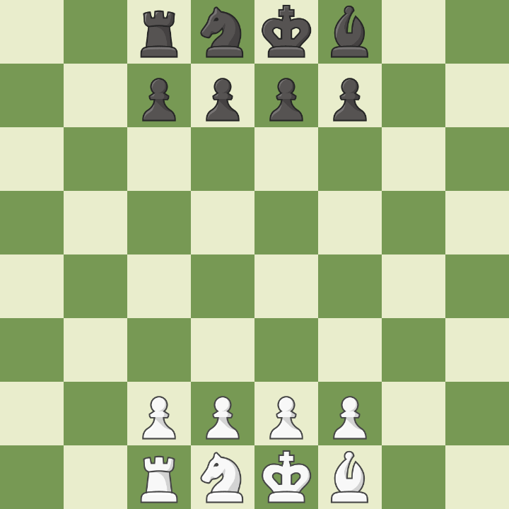

# Neural Network for Chess Position Evaluation 

In this project we tried to create a simple neural network, which predicts who is currently winning in a chess game. The project also involves creating our own datasets with the help of [Stockfish](https://stockfishchess.org) the strongest chess engine at the time, and the ability to play against the trained neural network. Because this is a student project, and we have limited resources, we decided to focus on "mini chess", a chess variation with less pieces to make the training process easier and faster. 
 
Neural Network vs. Random Moves            |  Variation Two
:-------------------------:|:-------------------------:
  |  
## Getting Started

To start creating your own data you can execute the dataCreation.py file.

```
python dataCreation.py --amount=10 --random=0.5
```

After creating the data you can train the model with the train.py file.

```
python train.py --epoch=100 --batch=100 --dataset=data/miniChess.csv --name=model.pt --lr=0.1
```

The final step is now to play against the trained model, or let the trained model play against a bot.

```
python play.py --model=models/model.pt --play=y
```

### Installing

To install all the libraries that we are using run pip install with the requirements.txt

```
pip install -r requirements.txt
```

## Built With

* [Dropwizard](http://www.dropwizard.io/1.0.2/docs/) - The web framework used
* [Maven](https://maven.apache.org/) - Dependency Management
* [ROME](https://rometools.github.io/rome/) - Used to generate RSS Feeds

## Contributing

Please read [CONTRIBUTING.md](https://gist.github.com/PurpleBooth/b24679402957c63ec426) for details on our code of conduct, and the process for submitting pull requests to us.

## Authors

* **Silas Ueberschaer** - *Initial work* - [Deischox](https://github.com/Deischox)

* **Benjamin Pöhlmann** - *Initial work* - [Bepo1337](https://github.com/Bepo1337)


## License

This project is licensed under the MIT License - see the [LICENSE.md](LICENSE.md) file for details

## Acknowledgments

* Hat tip to anyone whose code was used
* Inspiration
* etc
